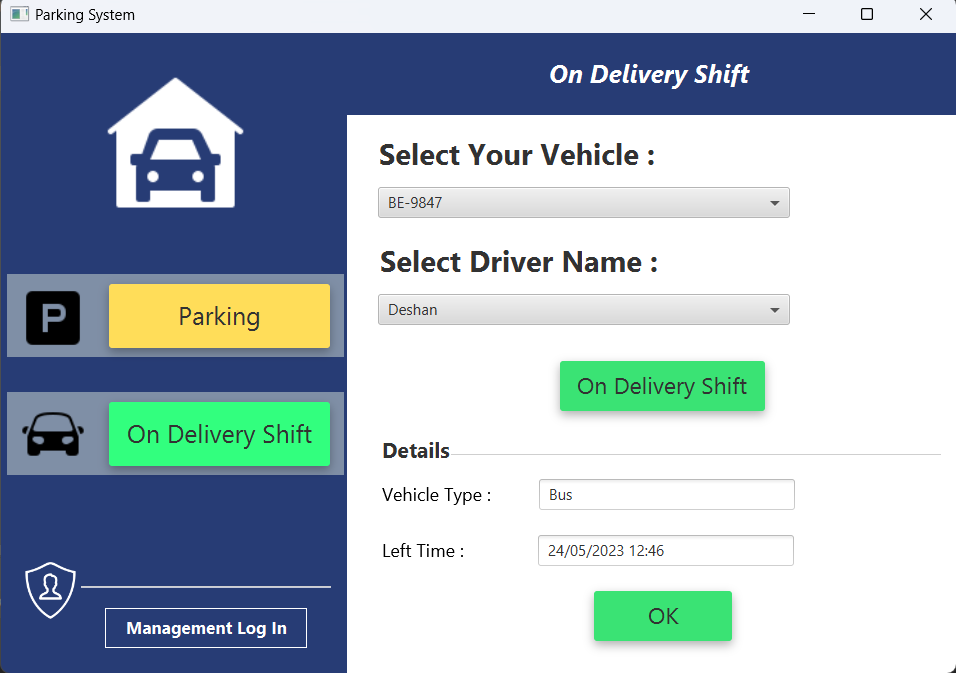

# Car Parking System

## Built With
#### Languages

• JAVA  

#### Frameworks & Libraries

• JavaFX  

#### Architectures

• MVC Architectures  

### What is this?

A stand-alone application designed for a company parking place to handle its
parking slots and driver details. Also it allows the administrator to manage vehicle
details and driver details.

### Purpose ?

This project is built to practice Java OOP concepts and improve problem solving skills and consistent logical thinking.

